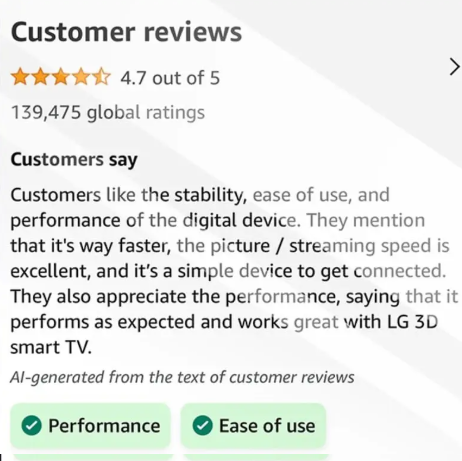
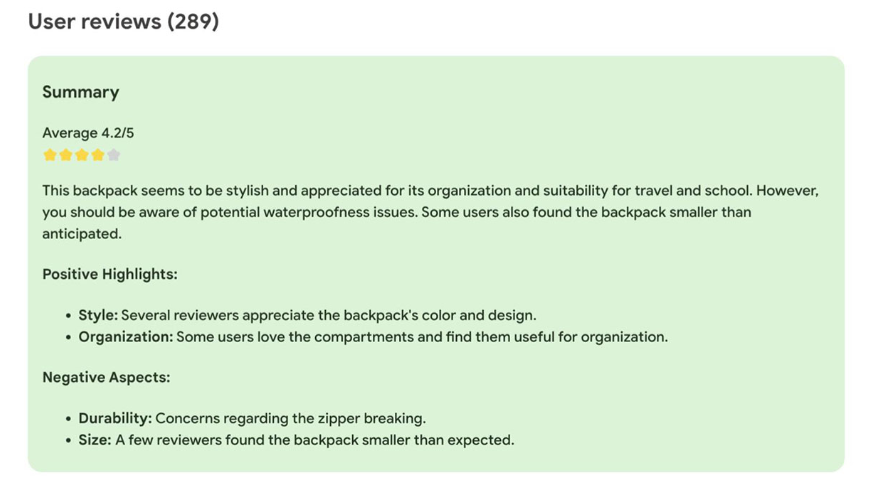

# Smart Search

Uma demonstração de busca inteligente com IA, integrando dados e facilitando a descoberta de informações.

---

## 📌 Sobre o Projeto

Este projeto foi desenvolvido como parte de um desafio da DIO, com o objetivo de explorar os conceitos de busca inteligente utilizando os serviços de IA da Azure. Foi alimentado um banco de dados com informações específicas, e este projeto registra o uso da IA sobre esses dados armazenados. No caso, foram utilizadas análises de reviews de filmes.

---

## ⚙️ Como Funciona

1. Realizei uma coleta de reviews de usuários sobre o filme "Capitão América".
2. Criei uma pasta chamada `inputs` e armazenei as análises junto com os nomes de usuário e notas atribuídas.
3. Alimentei o banco de dados da Azure conforme o tutorial fornecido.
4. Utilizei o Smart Search para recuperar dados extraídos com a IA.

---

## 📊 Insights Obtidos

A partir dos resultados, foi possível perceber que a IA consegue classificar comentários e avaliações de usuários com bastante eficiência:

- Análises positivas e negativas foram facilmente identificadas.
- A neutralidade das análises também foi bem percebida.

Algumas possíveis aplicações dessa tecnologia incluem:

- Monitoramento de redes sociais
- Análise de feedback de clientes
- Ferramentas de atendimento automatizado
- Classificação automática de sentimentos em pesquisas e reviews

---

## 🧠 Exemplos de Uso com Outras IAs

Grandes empresas de tecnologia, como a Amazon, e ferramentas disponíveis em extensões do Google Chrome já utilizam serviços de IA para análise de sentimentos, resumindo a opinião geral dos usuários sobre um produto ou serviço.

---
